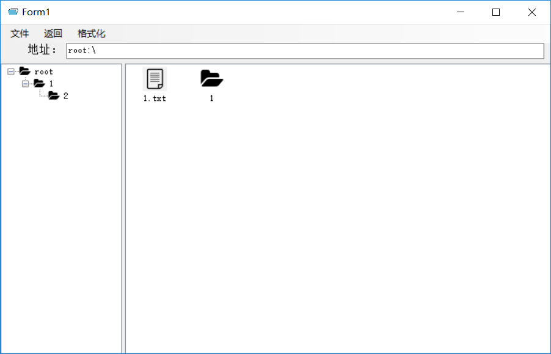

# 文件管理大作业

[TOC]

# 1. 使用说明

## 1.1 项目简介

文件(File)是操作系统中的一个重要概念。在系统运行时，计算机以进程为基本单位进行资源的调度和分配；而在用户进行的输入、输出中，则以文件为基本单位。大多数应用程序的输入都是通过文件来实现的，其输出也都保存在文件中，以便信息的长期存及将来的访问。当用户将文件用于应用程序的输入、输出时，还希望可以访问文件、修改文件和保存文件等，实现对文件的维护管理，这就需要系统提供一个文件管理系统，操作系统中的文件系统(File System)就是用于实现用户的这些管理要求。

基于此，为加深对操作系统文件系统的理解，设计一个文件系统模拟程序。

## 1.2 项目目的

●理解文件存储空间的管理；

●掌握文件的物理结构、目录结构和文件操作；

●实现简单文件系统管理；

●加深文件系统实现过程的理解；

## 1.3 项目功能要求

### 1.3.1 基本要求

●在内存中开辟一个空间作为文件存储器，在其上实现一个简单的文件系统;

●退出这个文件系统时，需要该文件系统的内容保存到磁盘上，以便下次可以将其回复到内存中来。

### 1.3.2 具体要求

●文件存储空间管理可采取显式链接（如FAT）或者其他方法；

●空闲空间管理可采用位图或者其他方法；

●文件目录采用多级目录结构，目录项目中应包含：文件名、物理地址、长度等信息。

### 1.3.3 文件系统提供的操作：

●格式化

●创建子目录

●删除子目录

●显示目录

●更改当前目录

●创建文件

●打开文件

●关闭文件

●写文件

●读文件

●删除文件

 ……

## 1.4 操作手册

### 1.4.1 窗口内容


### 1.4.2 新建文件/文件夹

以文件为例（文件夹操作相同）：

菜单->文件->新建->文件（文件夹）或 右键菜单->新建->文件（文件夹）


输入文件名：


创建成功：


### 1.4.3 删除文件

选择文件->右键->删除


删除成功：



### 1.4.4 读写文件内容：

双击1.txt，打开文件，输入内容


点击关闭，提示保存


再次打开，文件读入：


### 1.4.5 重命名

选中文件/文件夹，右键，重命名


输入新名字


重命名成功：


### 1.4.6 详细信息

选中文件/文件夹，右键，详细信息


展示详细信息：


### 1.4.7 目录切换

双击文件夹，进入子目录


点击返回按钮，返回子目录


### 1.4.8 格式化

点击格式化按钮


格式化成功


# 2. 程序设计与实现

## 2.1 设计

### 2.1.1整体设计

#### ①主要设置

**物理空间分配：**物理块大小：512 Bits，空间大小：1000000个物理块，总计约512 MB大小。

**文件存储物理结构：**链接（串联）结构

**位图管理：**1000000/8=125000个字节即可表示所有物理块

**目录结构：**多级目录结构——树形目录

#### ②单文件管理

采用File表示文件类，建立FCB表示文件属性，FCB中存储文件类型、文件名、大小、创建时间、修改时间、文件路径、文件指针等信息。

#### ③文件目录管理

建立Catalog表示文件目录，建立Node类表示目录中的一个项，Node有两种类型：folder与file，其中folder不属于File类型而属于catalog类型，整体结构为多级Catalog的嵌套。

#### ④文件存储管理

采用链接（串联）结构作为物理结构，利用位图管理空闲空间，存储单位为大小为512 Bits的物理块。

#### ⑤将文件保存到磁盘

在系统关闭时，会将所需存储的变量进行二进制序列化操作，生成两个.dat 文件，保存到磁盘上，达到存储到磁盘上的目的。


在系统打开时，会在初始化函数里读取两个文件进行去序列化操作，并将其赋予相应的变量，达到读取磁盘上内容的目的。

### 2.1.2 数据结构设计

采用一个长为512字节的字符串来表示一个物理块

采用List结构存储一个文件的物理块链表

采用一个长为125000的bool数组作为位图

采用List来存储文件目录

## 2.2 主要类结构设计及实现

### 2.2.1 Block类

```C#
public class Block
    {
        private const int BLOCKSIZE = 512;  // 数据块大小为512Bytes
        private char[] data;  // 一个数据块可以存储512个Unicode字符
        private int length;   // 块所用长度
        //public int blockNumber = 0; //块号

        public Block()
        {
            data = new char[BLOCKSIZE];
        }

        public void setData(String new_data)
        {
            length = (new_data.Length > 512) ? 512 : new_data.Length;
            for (int i = 0; i < length; i++)
            {
                data[i] = new_data[i];
            }
        }

        public String getData()
        {
            String temp = new String(data);
            return temp;
        }
    }
       
```

### 2.2.2 BitMap类

```C#
public class BitMap
    {
        private const int BYTESIZE = 8;    //字长，模拟一字节8位
        private const int CAPCITY = 100 * 100 * 100;    //内存空间最大块数（容量），521B*1000,000约512MB
        private const int BYTENUMBER = 100 * 100 * 100 / 8; //125000个字节即可表示所有块数
        public Block[] blocks = new Block[CAPCITY];    //所有块
        private bool[] bitMap = new bool[CAPCITY];     //位图

        //构造函数
        public BitMap()
        {
            for (int i = 0; i < CAPCITY; i++)
            {
                //blocks[i].blockNumber = i;
                bitMap[i] = true;
            }
        }

        //寻找一个空块
        public int findFreeBlock()
        {
            int bytePointer = 0;    //字号
            int bitPointer = 0;     //位号
            while (bytePointer < BYTENUMBER)    //字号在限制范围内
            {
                if (bitMap[bytePointer * BYTESIZE + bitPointer])//寻找到空块
                {
                    return (bytePointer * BYTESIZE + bitPointer);
                }
                else
                {
                    bitPointer += 1;
                    if (bitPointer == BYTESIZE)//位号超出限制
                    {
                        bitPointer = bitPointer % BYTESIZE;
                        bytePointer += 1;
                    }
                }
            }
            return -1;
        }

        //置某一结点为空闲
        public void setFree(int i)
        {
            bitMap[i] = true;
        }

        //置某一结点为占用
        public void setOccupy(int i)
        {
            bitMap[i] = false;
        }
    }private const int BYTESIZE = 8;    //字长，模拟一字节8位
private const int CAPCITY = 100 * 100 * 100;    //内存空间最大块数（容量），521B*1000,000约512MB
private const int BYTENUMBER = 100 * 100 * 100 / 8; //125000个字节即可表示所有块数
public Block[] blocks = new Block[CAPCITY];    //所有块
private bool[] bitMap = new bool[CAPCITY];     //位图
```

### 2.2.3 FCB类

```C#
public class FCB
    {
        public enum FileType { txt };  // 文件类型枚举
        public FileType fileType;   //文件类型
        public int fileSize;  // 文件大小
        public String fileName;  // 文件名
        public DateTime createdTime;  // 创建时间
        public DateTime updatedTime;  // 修改时间
        public List<Block> blocklist;      // 文件指针
        public String path;
    }
```

### 2.2.4 File类

```C#
public class File
    {
        public FCB fcb = new FCB();                // FCB

        //构造函数
        public File(String name, String type, String fatherPath)
        {
            fcb.fileType = FCB.FileType.txt;
            fcb.fileName = name;
            fcb.createdTime = DateTime.Now;
            fcb.updatedTime = DateTime.Now;
            fcb.fileSize = 0;
            fcb.blocklist = new List<Block>();
            fcb.path = fatherPath + "\\" + name;
        }

        //清空文件块
        public void setEmpty(ref BitMap bitmap)
        {
            for(int i=0; i < fcb.blocklist.Count(); i+=1)
            {
                bitmap.setFree(bitmap.findFreeBlock()); //置该块为空闲
            }
            fcb.blocklist.Clear();                      //清空块链表
            fcb.fileSize = 0;                           //文件大小置为0
        }

        //写文件
        public void write(String data, ref BitMap bitmap)
        {
            setEmpty(ref bitmap);
            while (data.Count() > 512)
            {
                bitmap.blocks[bitmap.findFreeBlock()] = new Block();
                bitmap.blocks[bitmap.findFreeBlock()].setData(data.Substring(0, 512));   //每次截取512个字符加入寻找到的块中
                fcb.blocklist.Add(bitmap.blocks[bitmap.findFreeBlock()]);                //将块加入块链表
                bitmap.setOccupy(bitmap.findFreeBlock());                                //置此块为占用状态
                fcb.fileSize += 512;
                data = data.Remove(0,512);
            }
            bitmap.blocks[bitmap.findFreeBlock()] = new Block();
            bitmap.blocks[bitmap.findFreeBlock()].setData(data);
            fcb.blocklist.Add(bitmap.blocks[bitmap.findFreeBlock()]);                //将块加入块链表
            bitmap.setOccupy(bitmap.findFreeBlock());
            fcb.fileSize += data.Length;
            fcb.updatedTime = DateTime.Now;
        }

        //读文件
        //获取文件内容
        public String getData()
        {
            string content = "";
            for (int i = 0; i < fcb.blocklist.Count(); i += 1)
            {
                content += fcb.blocklist[i].getData();
            }
            return content;
        }
        //获取文件名称
        public String getName()
        {
            return fcb.fileName;
        }
        //获取文件大小,单位为Byte
        public int getfileSize()
        {
            return fcb.fileSize;
        }
        //获取文件创建时间
        public DateTime getcreatedTime()
        {
            return fcb.createdTime;
        }
        //获取文件修改时间
        public DateTime getupdatedTime()
        {
            return fcb.updatedTime;
        }
    }
```

### 2.2.5 Node类

```C#
public class Node
    {
        public enum NodeType { folder, file };  // 结点类型
        public NodeType nodeType;   //结点类型
        public File file;           //节点内容
        public Catalog folder;      //节点内容
        public String path;  // 路径
        public String name;  // 名字

        public Node(String namedata, String fatherPath)   //文件夹结点
        {
            nodeType = NodeType.folder;
            path = fatherPath + "\\" + namedata;
            name = namedata;
            folder = new Catalog(namedata, fatherPath);
        }

        public Node(String namedata, String fileType, String fatherPath)    //文件结点
        {
            nodeType = NodeType.file;
            path = fatherPath + '\\' + namedata;
            name = namedata;
            file = new File(name, fileType, fatherPath);
        }

        public void changeName(String changed_name)
        {
            name = changed_name;
            switch (nodeType)
            {
                case Node.NodeType.folder:
                    folder.path = folder.path.Remove(folder.path.Length-folder.name.Length-1,folder.name.Length+1);
                    folder.name = changed_name;
                    folder.path = folder.path + "\\" + folder.name;
                    break;
                case Node.NodeType.file:
                    file.fcb.path = file.fcb.path.Remove(file.fcb.path.Length - file.fcb.fileName.Length - 1, file.fcb.fileName.Length + 1);
                    file.fcb.fileName = changed_name;
                    file.fcb.path = file.fcb.path + "\\" + file.fcb.fileName;
                    break;
                default:
                    break;
            }
        }
    }
```

### 2.2.6 Catalog类

```C#
public class Catalog
    {
        public List<Node> nodelist; //目录中只含结点
        public int childrenNum;  // 子结点的数量
        public String name;  // 名字
        public String path;  //路径
        public int fileSize;  // 文件大小
        public DateTime createdTime;  // 创建时间
        public DateTime updatedTime;  // 修改时间
        public Catalog parent_catalog = null; //父母节点

        //其他目录
        public Catalog(String namedata, String fatherPath)
        {
            nodelist = new List<Node>();
            name = namedata;
            path = fatherPath + '\\' + namedata;
            createdTime = DateTime.Now;
            updatedTime = DateTime.Now;
            fileSize = 0;
            childrenNum = 0;
        }

        //根目录
        public Catalog(String namedata)
        {
            nodelist = new List<Node>();
            name = namedata;
            path = namedata + ":\\";
            createdTime = DateTime.Now;
            updatedTime = DateTime.Now;
            fileSize = 0;
            childrenNum = 0;
        }

        //添加文件夹结点
        public void addNode(Catalog par_catalog, String namedata, String fatherPath)
        {
            Node node = new Node(namedata, fatherPath);
            node.folder.parent_catalog = par_catalog;
            nodelist.Add(node);
            childrenNum += 1;
            updatedTime = DateTime.Now;
        }

        //添加文件结点
        public void addNode(String namedata, String fileType, String fatherPath)
        {
            Node node = new Node(namedata, fileType, fatherPath);
            nodelist.Add(node);
            childrenNum += 1;
            updatedTime = DateTime.Now;
        }
    }
```

# 3.边界测试

## 3.1已返回到根目录再返回

**测试用例：**

在下图情况下进行测试，点击返回按钮


**测试结果：**

系统给出提示，已是根目录。

## 3.2空间为空时进行格式化

**测试用例：**

在下图情况下进行测试，点击格式化


**测试结果：**

无变化，系统正常运行

## 3.3新建文件重名

**测试用例：**

在下图情况下进行测试，创建一个名字为1的文件


**测试结果：**

首先检测当前目录下内容，自动更改默认名字为New File(1)，输入1后，新建文件名如下：


# 附录：

## 6.1 文件说明

`executablefile`文件夹：可执行文件

`FileManagement`文件夹:由Visual Studio生成的项目文件，包括.sln文件以及项目代码

`readme`文件夹:项目文档

## 6.2 开发环境

- 操作系统：windows10 1803 64bit
- 语言：C#（FrameWork）
- 开发环境：Visual Studio Community 2017     15.9.10